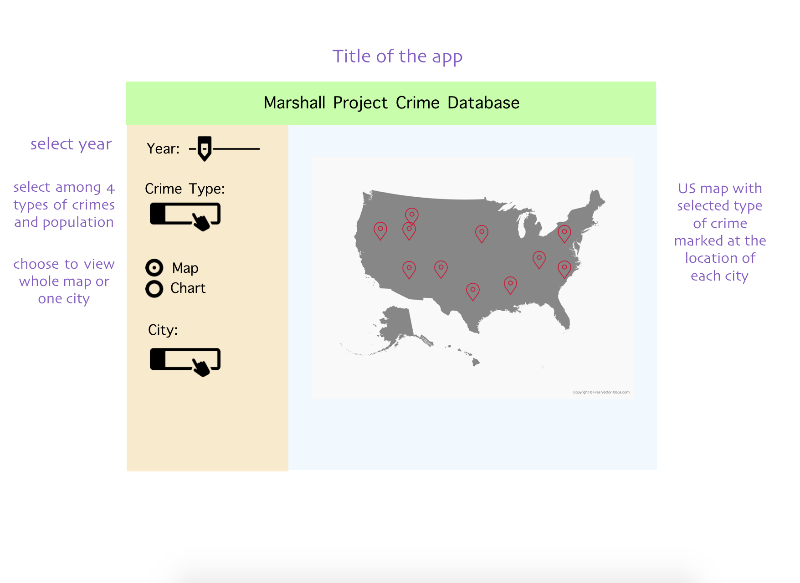
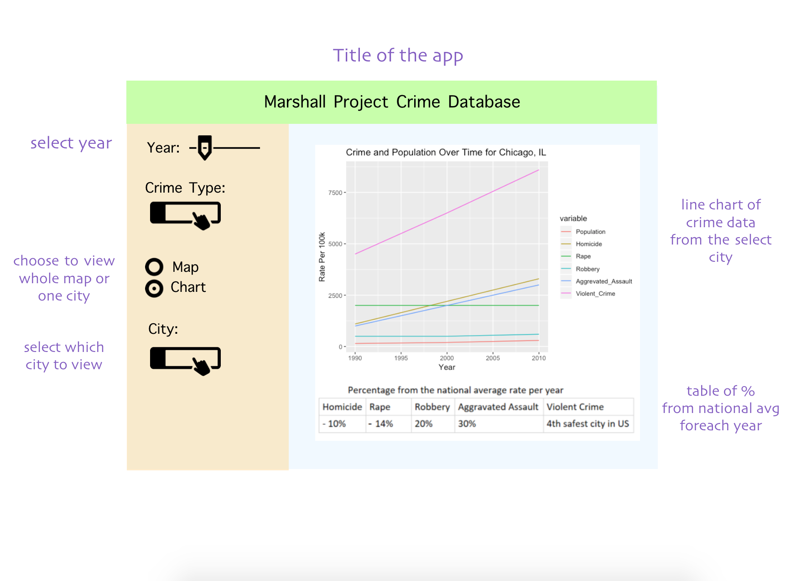

### Section 1: Overview

Policy makers at the national level are faced with the hard task of understanding where to best allocate their limited resources. In particular, they have to figure out how to effectively provide resources to different cities with the eventual goal of lowering crime nationally. Meanwhile, policy makers and law enforcement at a city level need to make tradeoffs between putting more or less resources into various different types of crime enforcement to maximize the overall safety of their population. Both groups need to see historical crime data to understand trends and measure the effectiveness of their programs. In order to assist these policymakers, we propose building a data visualization app that will let national policy makers explore crime rates and populations by U.S. city for different time periods and will let city policy makers look at crime rates and population over time for each city.

### Section 2: Description of the data

The [Marshall Project Dataset](https://github.com/themarshallproject/city-crime) we will be visualizing contains crime data from 68 US cities from 1975 to 2015. The data set contains the total number of violent crimes for each city which is a summation of homicide, rape, robbery and aggravated assault crimes. It also contains population numbers, number of months reported, occurrences per 100,000 of population for each type of crime, department name, unique identifier, source and URL.
The features we will visualize in our app will include population, violent crime per 100k people, homicide per 100k people, rape per 100k people, robbery per 100k people and aggravated assault per 100k people over time for each year the data is available.
In addition we might add latitudes and longitudes for each city to build a map in Shiny, if necessary.

### Section 3: Usage scenario & tasks

Our target audience is policy makers and politicians at various levels of government. We have broken our app into two main representation that show a nation scale and individual metrics of each city. 

##### Usage Scenario 1:
The user wants to compare whether violent crime rate is greater in Chicago or Miami in 1991. On the side panel they would select violent crimes and slide the time bar to 1991 and then compare the size of the point over each city to determine which is greatest. This scenario can be varied for any feature and any year. This scenario would use the mapping tab.

##### Usage Scenario 2:
After seeing which city out of Chicago or Miami had the highest violent crime rate the user wants to determine which types of violent crime contributed to this high rating. Select the city and chart tab. Then timeline plots for all of the features would appear and the reader will be able to see how each of the sub categories (homicide, rape, robbery and  aggravated assault) contribute to the total amount of violent crimes.  

##### Usage Scenario 3:
A politician giving a talk and is trying to convince colleagues that more resources need to be allocated to Boston to help with the rising homicide rate. They open the app to the maps tab, center the screen on Boston and select homicide. They slowly slide the time lapse bar while mentioning, “The rates are much higher in Boston than other cities and have been steadily increasing in the past few years”. The crowd is able to see the circle over Boston is increasing and much larger than all the other cities. Then he clicks on tab 2 and the crowd can see that the homicide values over the past few years are very high above the national average.

### Section 4: Description of  app & sketch 

For this app we want users to be able to visualize crime data in an interactive and easy manner. We plan to visualize our data with 2 tabs. The tab will be selected from the side panel.  

**Tab One**: Displays a map of the United States where that the features can be controlled by a time lapse bar. You will be able to select a feature and then move the time bar to show the values over different years. The size of the point will be mapped to the value of the feature, higher values will be a larger circle. This allows you to see how the rates change over time and also allows you to make comparison across the country. The panel will contain a slide bar to control the year that is currently being displayed on the map. There will be a method to select one of our six features which include population per 100k people, homicide per 100k people, rape per 100k people, robbery per 100k people, aggravated assault per 100k people and violent crime per 100k people. 

**Tab Two**: Time line plots for all six of the features filtered by city, where city will be selected in the side panel. This panel will help users make comparisons among the different types of crime for a single city and can see how each feature contributes to violent crimes. There will be a table that lists each feature(homicide, robbery, etc.) and compares the city to the national average value for that feature per year, the year will be selected from time bar. 

